## How to Combine HomeKit with React Native in 10 Minutes

<p>

</p>

Whether you’re developing the next home automation app or a new hardware device for your home, if you want it integrated with HomeKit and Siri, the developer resources out there are pretty slim. Apple provides their API docs, which are a great starting point. However, there’s a huge gray area if you don’t already understand how services, accessories, and characteristics work. And to make matters worse, if you want to do all of this in React Native, you’ll find neither official documentation, nor updated/documented 3rd party libraries.

With no easy tutorials, drag-and-drop libraries, or hand holding, I took the plunge. In this post, I’m sharing what I learned over a long weekend, so that it only takes you 10 minutes.

### Step 1: Project Setup

Create a new React Native project using the TypeScript template:
`npx react-native init MyApp --template react-native-template-typescript`

**For M1 Users:**
In the package.json file I like to preemptively add some helper commands that I know I’m going to need, because Xcode and Pods are fickle. I also replaced the ios command to just open the project directly in Xcode, because currently running a React Native iOS project from the terminal on an M1 is nebulous and error-prone:

```bash
"clean-ibuild": "cd ios && rm -rf Pods Podfile.lock && pod deintegrate && pod setup && pod install && cd .."
"ios": "xed -b ios"
```

### Step 2: HomeKit Capabilities

Open up the Xcode project and go to your `project’s name -> Targets -> Signing and Capabilities -> Plus Button -> Add the HomeKit integration`

<p>
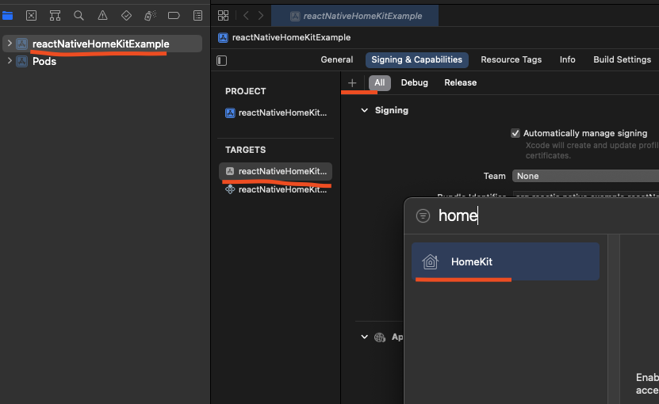
</p>

This is necessary so that your app can access your HomeKit data. The app will then be able to ask for HomeKit permission the first time you run it.

While you’re here, make sure to assign a Development Team to your app.

<p>
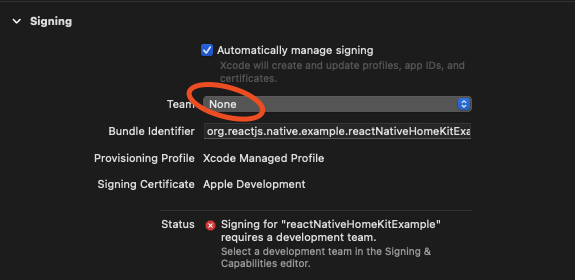
</p>

Then build the app in Xcode and make sure to run it on a physical device. Adding HomeKit accessories doesn’t work in a simulator. You’ll get some nonsense error like this that Apple doesn’t have any docs to explain:

`sendMessageWithDictionary: Failed to get remote object proxy: Error Domain=NSCocoaErrorDomain Code=4097 "connection to service named com.apple.rtcreportingd" UserInfo={NSDebugDescription=connection to service named com.apple.rtcreportingd}`

### Step 3: HomeKit Simulator

Download the HomeKit Accessory Simulator. This tool is really great, and allows us to simulate any type of home device we want and control it! Once you add the HomeKit capability, there will be a button to go to additional dev downloads:

<p>

</p>

Go to that page, and be immediately confused because there’s nothing in there called “HomeKit Simulator.” But don’t worry, it’s inside this package:

<p>
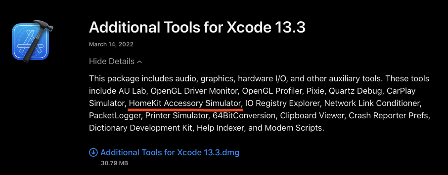
</p>

Once downloaded, open up the simulator and add a new accessory (bottom left corner there’s a plus sign). Call it whatever you like:

<p>
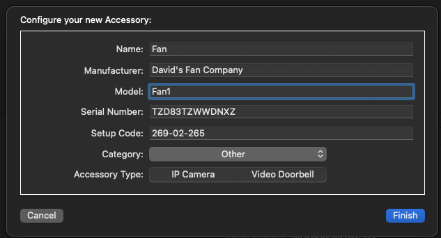
</p>

Then add a Service at the bottom. Call this whatever you like as well.

<p>
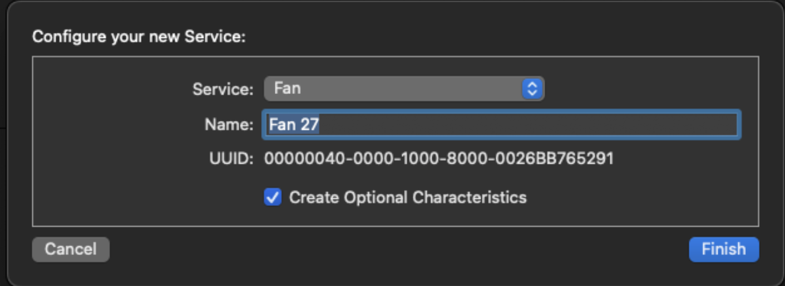
</p>

As long as your computer and phone are on the same network, the simulator should broadcast the device correctly.

### Step 4: Swift Setup

We’re now going to go through the process of making a Native Module, which is how React Native interacts with our own native code made with Swift or Kotlin. In Xcode, create a new Swift file called **RCTHomeKitModule**. The name can be whatever you like, but I like using this pattern so that I know what files React Native is meant to consume.

<p>
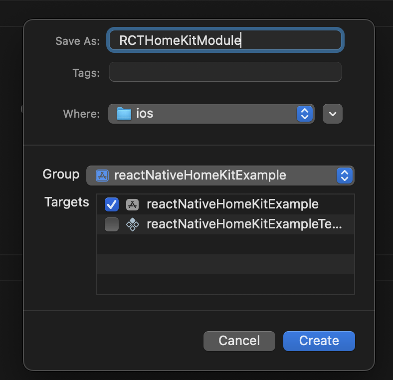
</p>

You’ll then be asked if you want to automatically create an Objective-C bridging header file. We absolutely want this, so accept:

<p>
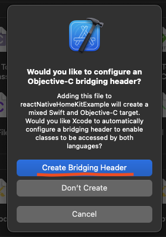
</p>

Then create an m file, or Objective-C file, with the same name. Your project structure should look like this:

<p>
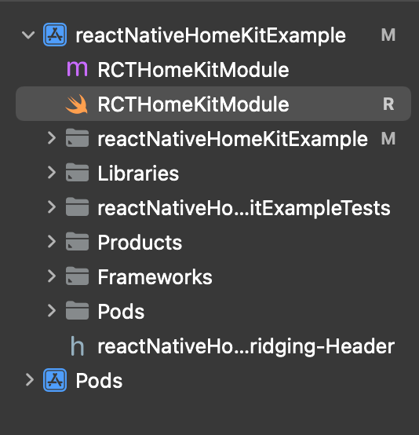
</p>

### Step 5: Basic HomeKit Action

Now let’s add a single interaction with the HomeKit API. There are a million ways we could interact with this, but for the sake of simplicity, this post will just cover one. We’re going to add a function that brings up the iPhone HomeKit accessory QR scanner, which adds a device to our home. In `RCTHomeKitModule.swift`, add this in place of everything:

```swift
import HomeKit

@objc(HomeKitModule)
class HomeKitModule: RCTEventEmitter {
var homeManager = HMHomeManager()

// Specifically for React Native to know what the intention of our Native Module is (our init method is calling UI)
@objc override static func requiresMainQueueSetup() -> Bool {
    return true
}

// A necessary override which we won’t directly use, however this array holds the names of HomeKit events emitted that we can capture another time.
override func supportedEvents() -> [String]! {
    return ["findNewAccessory"]
}

// The function in question. When called, it will add a device you scan to your default home
@objc(addAndSetupAccessories:withResolver:withRejecter:)
func addAndSetupAccessories(name: String, resolve: @escaping(RCTPromiseResolveBlock), reject: @escaping(RCTPromiseRejectBlock)) -> Void {
    homeManager.homes[0].addAndSetupAccessories(completionHandler:
        { error in
            if let error = error {

            } else {
                resolve("")
            }
        })
    }
}
```

Next, replace everything in the `RCTHomeKitModule.m` file with this:

```objc
#import <React/RCTBridgeModule.h>
#import <HomeKit/HomeKit.h>
#import "React/RCTEventEmitter.h"

@interface RCT_EXTERN_MODULE(HomeKitModule, RCTEventEmitter)

RCT_EXTERN_METHOD(addAndSetupAccessories: (NSString \*)name withResolver:(RCTPromiseResolveBlock)resolve withRejecter:(RCTPromiseRejectBlock)reject)

@end
```

This exports the swift function so that it’s visible to React Native. Finally, replace everything in your `.h` bridging header file with this:

```objc
#import <React/RCTBridgeModule.h>
#import <React/RCTViewManager.h>
#import <React/RCTLog.h>
#import <React/RCTEventEmitter.h>
```

This exposes our public headers to swift. We’re all done on Xcode’s side.

### Step 6: Native Module Interaction

Switch back to your React Native project and open up `ios/reactNativeHomeKitExample/Info.plist`. Add this to the list of keys:

```xml
<key>NSHomeKitUsageDescription</key>
<string>HomeKit Example permission request message</string>
```

This registers the app’s ability to ask permission to access the HomeKit capability we added earlier in Xcode. The string message can be whatever you like for now.

Next, create a new file in `src/HomeKitModule/HomeKitModule.tsx`. Place this inside the file:

```typescript
import {NativeModules} from 'react-native';

type HomeKitType = {
  addAndSetupAccessories(name: string): Promise<any>;
};

const {HomeKitModule} = NativeModules;

export default HomeKitModule as HomeKitType;
```

This adds some basic types to our Native Module, based on what’s exported in the Objective-C file we made in Xcode. The promise returned by `addAndSetupAccessories` actually has a very specific type that I included in the repo, but for the sake of time, we’re just going to use any in this snippet. This small project isn’t going to do anything with the result of the promise anyway.

Next, in `App.tsx` replace everything with this:

```typescript
import React from 'react';
import {SafeAreaView, Text, TouchableOpacity} from 'react-native';
import HomeKitModule from './src/HomeKitModule/HomeKitModule';

const App = () => {
  return (
    <SafeAreaView>
      <TouchableOpacity
        onPress={async () => {
          await HomeKitModule.addAndSetupAccessories('');
        }}
        style={{
          backgroundColor: 'gray',
          padding: 10,
          margin: 10,
          borderRadius: 10,
        }}>
        <Text
          style={{
            color: 'white',
          }}>
          {' '}
          + Add HomeKit Device
        </Text>
      </TouchableOpacity>
    </SafeAreaView>
  );
};

export default App;
```

This adds a simple button that will call on the Native Module function we created.

### Step 7: Add Your Accessory!

Run the app in Xcode, making sure that you’re targeting a **physical** device! When the app loads, you should see a prompt to access your home data. After you accept, tap the `Add HomeKit Device` button and you should see this prompt:

<p>
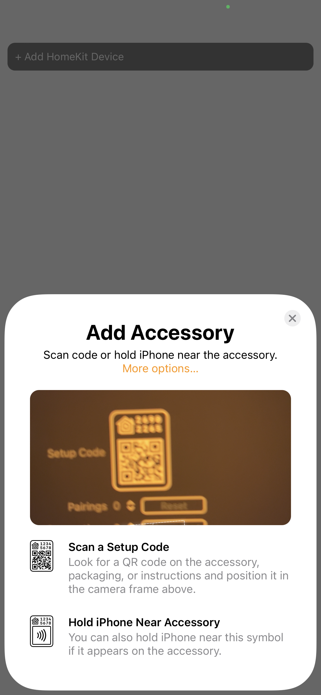
</p>

Hold your camera over the QR code in your HomeKit simulator here:

<p>
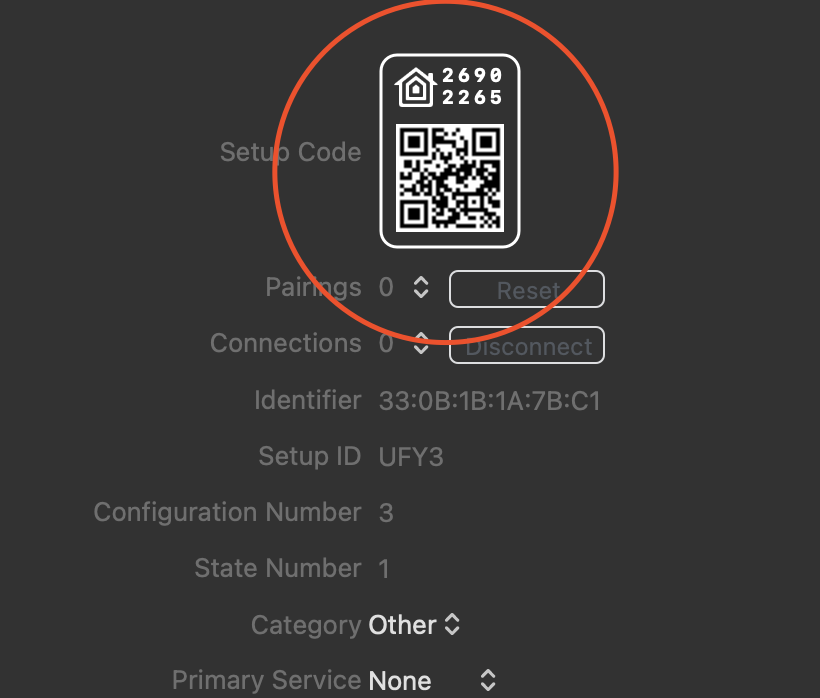
</p>

And then verify that the device was added by checking the official Home app on your phone. If it’s there, congratulations! Your simulated device is now a part of your home, and controllable by your phone! Play around with it in the Home app, and see how the HomeKit simulator characteristic values change live!

<p>
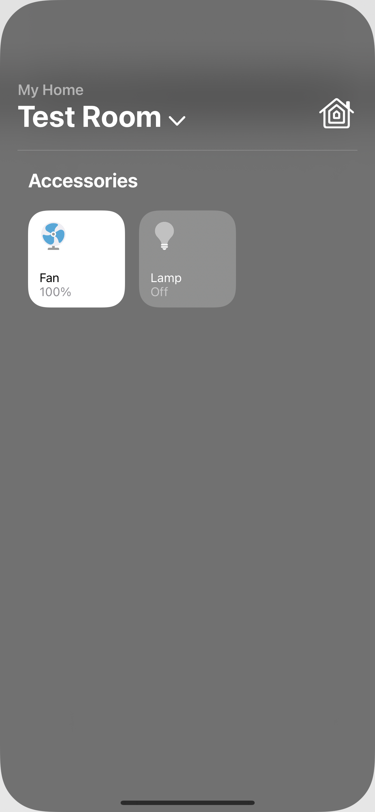
</p>

### What’s Next

This post shows the starting point and how to get the hard parts of HomeKit + React Native integration out of the way. In the future, we can build off of this topic and delve deeper into more advanced accessory management, characteristic updates, zone/room handling, filtering on manufacturers, and more!

### Troubleshooting

In this repo I use a `patch-package` patch for React Native to unset `npm_config_prefix` due to M1 build issues. If you're using an Intel Mac and are having build issues, try disabling the patch first.
